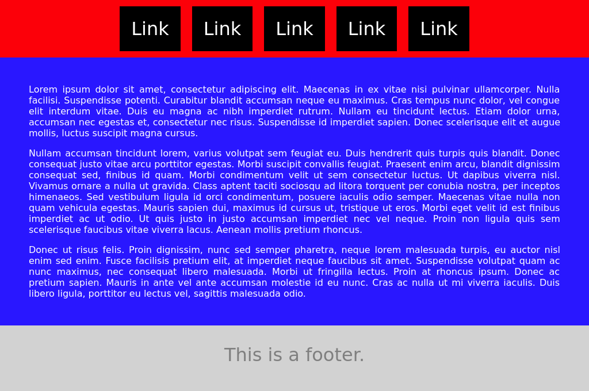

# Webpack Demo

A quick demonstration of how to bundle Vue.js [single file components] with webpack.

#### Featured Libraries

* Webpack
* PostCSS/Autoprefixer
* Babel/ES6
* Vue

#### How To Install

1. `npm install` : Install required modules
2. `npm build` : Bundles assets for browser
3. `npm start` : Starts Webpack dev server

#### How To Use

Open this URL in your browser.

[http://localhost:3000](http://localhost:3000)

[single file components]: https://vuejs.org/v2/guide/single-file-components.html
[webpack]: https://webpack.github.io/
